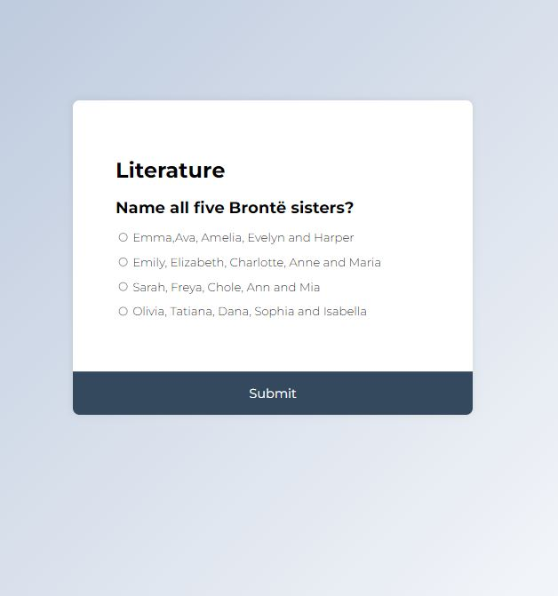
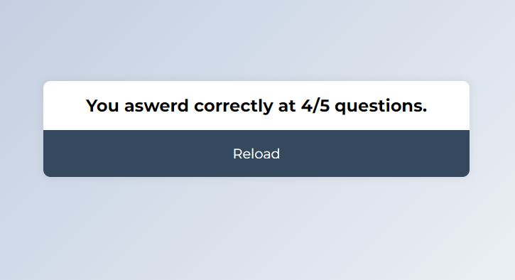
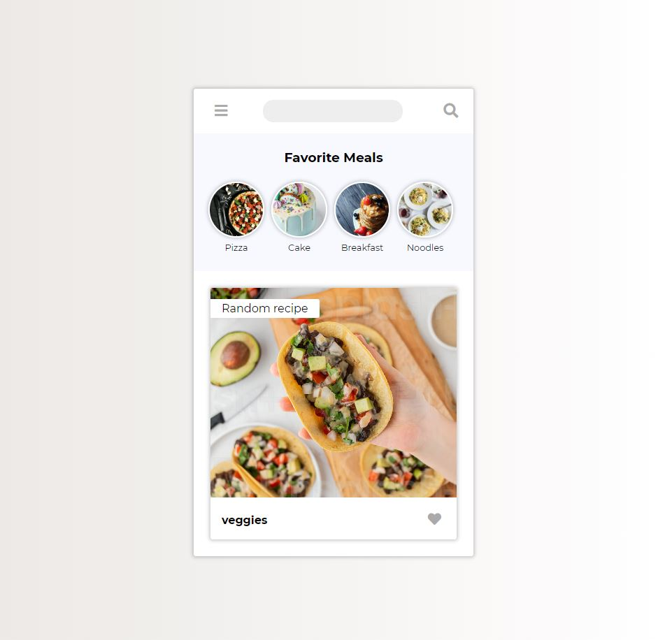
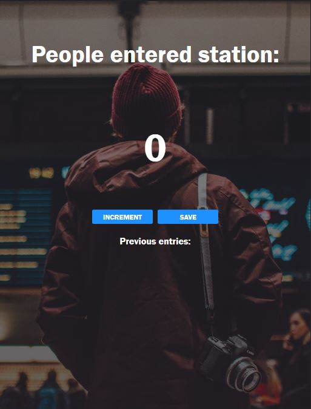
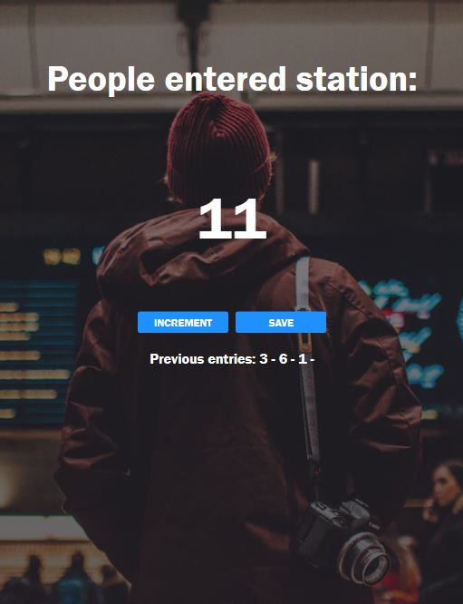
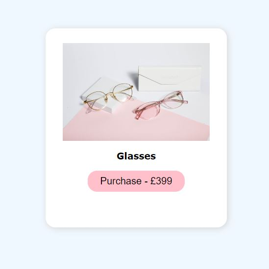
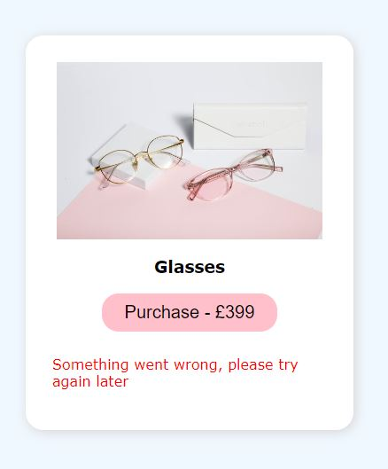

# TEN_JavaScript_Projects
# one_count_down_app

This countdown app is perfect for keeping track of important dates and times, the app features a beautiful design that will make staying organized a breeze.

<h3>Time up!</h3>

This app is a countdown timer and the app will count down and when the time is up it shows the text "TIME UP!!!".

# :clipboard: quiz_app

This app is a quiz app that tests your knowledge of literature

:white_check_mark: variables

:white_check_mark: numbers

:white_check_mark: strings

end of the quiz you can see your results

# :hamburger: three_recipes_app :sushi:
:curry: get random meals; 
:ramen: get meals by Id; 
:cake: get meals by search;

# :steam_locomotive: four_passanger_counter_app

covered concepts creating counter app 

:white_check_mark: script tag

:white_check_mark: variables

:white_check_mark: numbers

:white_check_mark: strings

:white_check_mark: console.log()

:white_check_mark: functions

:white_check_mark: the DOM

:white_check_mark: getElementById()

:white_check_mark: innerText

:white_check_mark: textContent

# five_Btn_error_message

When a customer presses the button, the button shows an error message

